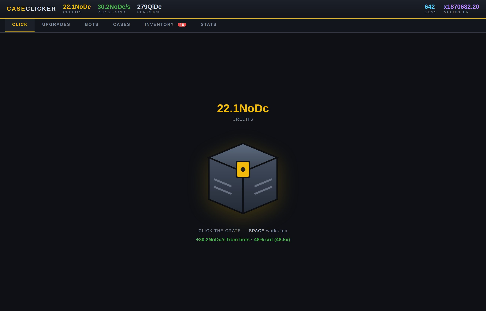

# Case Clicker

A free idle crate-opening clicker for Windows. 100 click upgrades, 100 autoclicker
bots and 100 crates across ten eras, with a real roulette unboxing spin and a
compounding prestige layer.

**[Download the latest release](../../releases/latest)** · Windows 10/11 64-bit · ~2.3 MB installer



## What it is

The whole game is a single Go executable. It starts a server on `127.0.0.1`,
serves the embedded `game.html`, and opens it in a borderless Edge/Chrome app
window using its own isolated profile. No Electron, no bundled browser runtime,
no .NET — which is why the download is 2 MB rather than 120 MB.

Nothing leaves your machine. The loopback server exists only so the game window
can read and write the save file.

## Features

- **100 click upgrades** across ten eras, plus crit chance and crit payout tracks
- **100 autoclicker bots**, from a Macro Script to The Architect
- **100 crates** with a five-second roulette spin; rare-special odds climb from
  0.12% to 7.5%
- **Skins that matter** — every one you keep is a passive boost to click *and*
  idle income
- **Compounding prestige** — gems are worth +5% each *and* a further x1.015,
  so every run reaches deeper
- **30 achievements**, each a permanent income bonus
- **Offline earnings** for up to 8 hours
- **Local saves** at `%APPDATA%\CaseClicker\save.json`, with export/import
- **In-app updates** — checks a feed, shows a banner, one click to install

## Building

Requires Go 1.24+. Cross-compiles from any platform:

```sh
GOOS=windows GOARCH=amd64 CGO_ENABLED=0 \
  go build -trimpath -ldflags "-s -w -H windowsgui" -o "Case Clicker.exe" .
```

The installer is built with [NSIS](https://nsis.sourceforge.io/):

```sh
makensis installer.nsi
```

Game content (the 100 bots / upgrades / crates tables) is generated:

```sh
python3 gen_content.py   # writes content.js, which is pasted into game.html
```

Run the tests with `go test ./...`.

## Publishing an update

See [HOW-TO-PUBLISH-UPDATES.txt](HOW-TO-PUBLISH-UPDATES.txt). Short version:
`make-release.sh` produces an `update.json` with the correct SHA-256, and you
attach it plus the installer to a GitHub release. The app verifies that checksum
before running anything it downloads.

## Website

`web/` is a complete static download page. Drop the folder on
[Netlify](https://app.netlify.com/drop) and it works as-is.

## Licence

MIT — see [LICENSE](LICENSE).

Not affiliated with Valve or Counter-Strike. No real items, trading, gambling or
money are involved; every credit and skin is fictional and stays on your computer.
